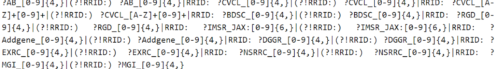
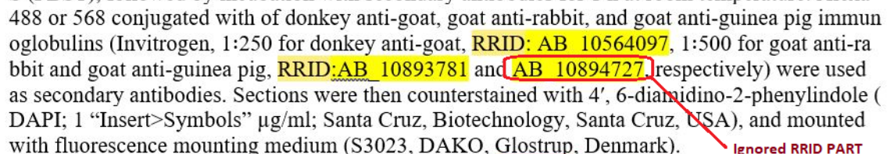
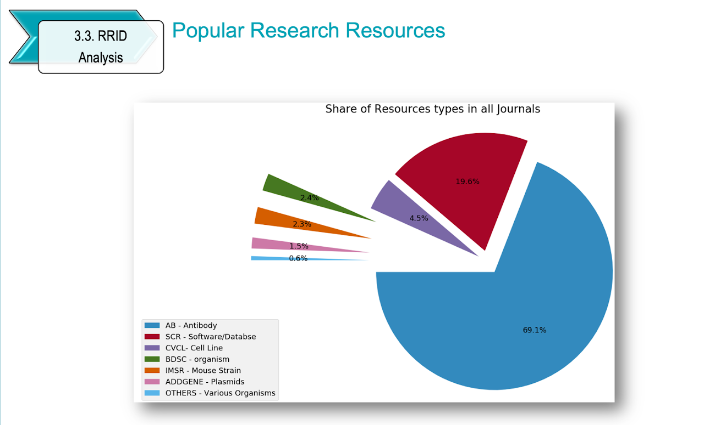
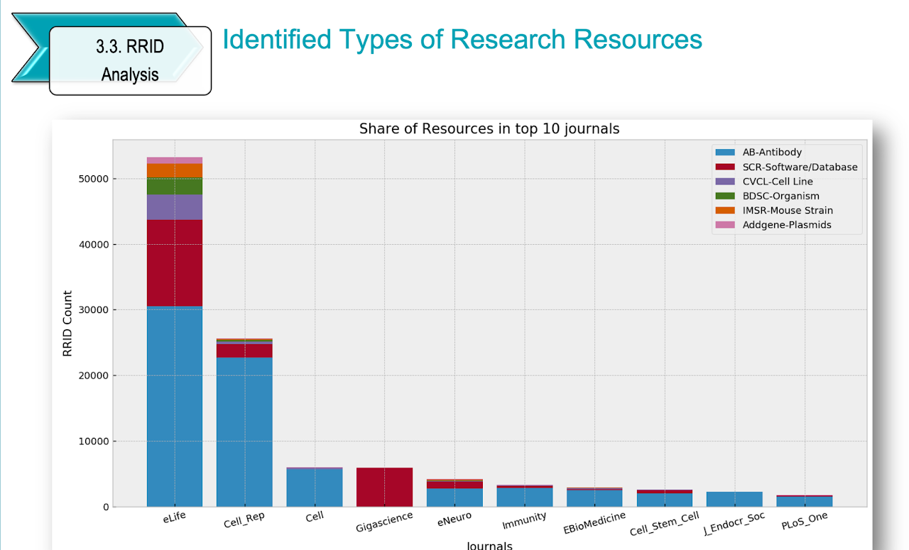
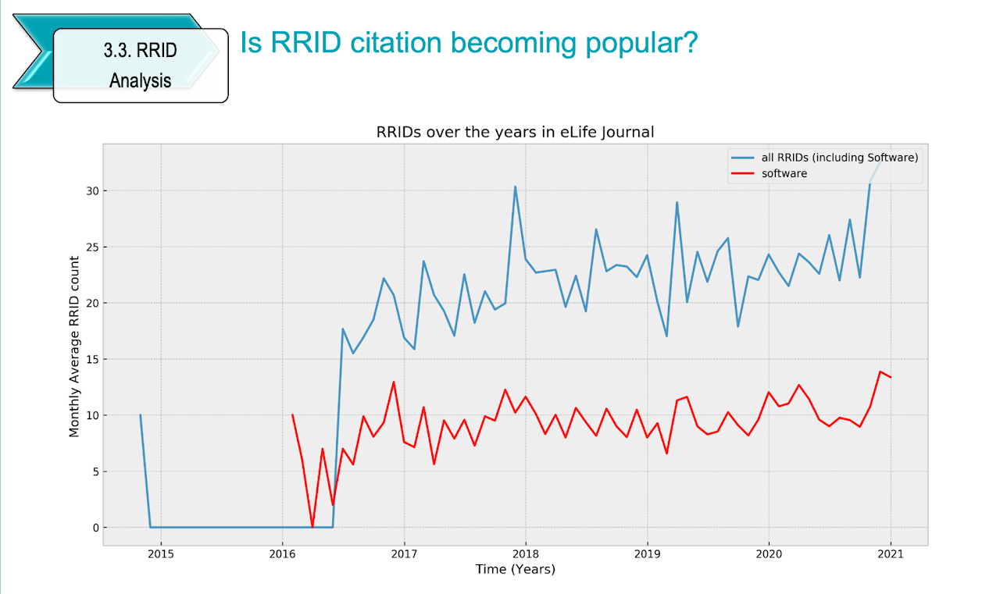

# XML Data Analysis using RRID Digital Identifiers 

This project is about evaluating how effective research resource identifiers (RRIDs) are. Reserch resource identifiers (RRIDs) are digital identifiers that are introduced by Resource Identification Initiative (RII) in 2014. 

RRIDs were designed by RII to be globally unique and persistent identifiers that help to better identify and track sources in the scientific literature and overcome reproducibility problems. RRIDs work similar to DOIs in principle but have a special pattern: `RRID:xx_xxxxxxxxx`. They are specifically used to identify research ingredients in the biomedical fileds from the Sci-crunch database. 

# Dataset :

- More than 3.2 Million XML files that are retrieved from PubMed and PLOs Journals are analized to extract insights about RRID usage patterns and effectiveness.

## Implementation Steps 
- RRID Patterns are expressed interms of regular expression patterns
- Parsed XML files to extract all instances of RRIDs in research papers and corrosponding resources
- WebScraping to cross reference the extracted identifiers at the Sci-Crunch database using beautiful soup
- Categorical analysis of the most cited resources
- Temporal analysis to see popularity of RRIDs over the years

## Insights :

- `152,598` RRID citations have been found in 660 PubMed Journals.
- Most researchers used RRID identifiers to cite resources in the correct syntax most of the time.
- Most research resources (about 90%) in the pubMed journal are Antibodies (AB) & software/Database resources.
- RRIDs use for citation of resources has become popular over the past 5 years nearly in all 660 PubMed journals.
- Popular software tools are statistical analysis and image processing software, like `GraphPad Prism`, `ImageJ`,`Matlab`, `Fiji` and `R`. 

## Some Visuals from the analysis 

##### RRID Regular Expression Pattern:

##### RRIDs in a research paper:

##### Various types of resources in Reserch Journals:

##### Top10 Journals by RRID use:

##### RRID Usage pattern over years:

View this project's Jupyter notebook [here.](https://htmlpreview.github.io/?https://github.com/BeTKH/Data-Mining-and-Analysis-Scientific-Publications/blob/main/html/RRID%20Analysis%20Final%20Paper.html)

Visit [Project Site](https://sites.google.com/view/bekaluetadesse/projects/project1)

